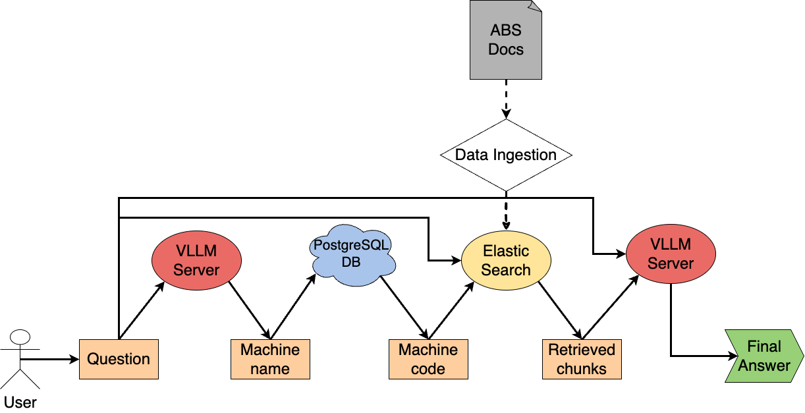

# Basic RAG Pipeline

This repository contains a Basic RAG pipeline designed for the specific ABS case. The schema below synthesizes how the pipeline works



The RAG pipeline requires $3$ main components:
- An LLM server configured through [VLLM](https://docs.vllm.ai/en/latest/), an open-source library that can be configured as an inference server. Essentially, the VLLM server is reachable through the same API used for OpenAI
- The PostgreSQL DB to retrieve the correct machine code given the machine name extracted by the LLM
- ElasticSearch: this vector store contains the necessary ABS documents

## How it works

The entire pipeline can be, essentially, summarized in $3$ main steps:

1. **Machine code extraction**: given the query related to a particular machine, the LLM extract the machine name. Then, the pipeline consists of querying the DB to retrieve the machine code related to the machine name. In this case, a connection to the PostgreSQL DB, available on Azure is required.
2. **Retrieval of useful documents**: Using the machine code and the query provided by the user, this second point consists of querying ElasticSearch and retrieving the chunks of text which contain useful information to answer the question. Before the running of the pipeline, ElasticSearch must contain the documentation. It is configured to use BM25 as Retrieval strategy
3. **Answer generation**: given as input the question and the chunk of documents, the LLM generate the answer

## Configuration

This section explains how to set up the environment and configure the entire pipeline. For the initial configuration of ElasticSearch, please follow the official documentation ([ElasticSearch Doc](https://www.elastic.co/guide/en/elasticsearch/reference/current/index.html))

### Python environment

The code is designed on Python $3.12.4$. To install an environment with the correct Python version run the following line:
```bash
conda create --name example_env python=3.12.4
```

The list of Python packages can be installed through the following commands:

```bash
conda activate example_env
pip install -r requirement.txt
```

### Grant access to PostgreSQL

To correctly reach the PostgreSQL DB provided through Azure service you need to set your public IP address in the correct section. 

### VLLM configuration

VLLM is an open-source library used to deploy a LLM. The configuration of the VLLM server requires the installation of the 
Python environment. The following guide is specific to DGX Station provided by BeanTech SRL. Small differences, mainly related to the setup of the Python environment might be necessary. First log on DGX Station and create a docker container with CUDA installed:
```bash
docker run --gpus 0 --name finetuning -it -p 3000:3000 \
      -v /raid/username/folder:/root/folder -d nvidia/cuda:12.2.2-runtime-ubuntu22.04
```
Then install Python and other useful things
```bash
apt install python3 python3-pip tmux
```

Install virtual environment

```bash
pip install virtualenv
```

Create a virtual environment in the home directory:

```bash
python3 -m virtualenv env_name
source env_name/bin/activate
```

Copy the files ``requirement_vllm.txt`` and ``run_mistral_vllm.sh`` in  the folder ``/raid/username/folder``. Then install 
the dependencies and run the server:

```bash
pip install -r requirement_vllm.txt
./run_mistral_vllm.sh
```

On your local PC set the port forwarding to access the model

```bash
ssh -L 3000:localhost:3000 -N <connection_string_to_dgx>
```

VLLM server is now up and running!!

### ElasticSearch data ingestion

The data ingestion consists of inserting the documents into the ElasticSearch vector store. 

```bash
python data_ingestion_emb.py --document_path <document_folder>
```
The document must be parsed in JSON format (one page per JSON object). An example of data ingestion is 

## Run the pipeline

The repository contains a simple example of how to run the entire pipeline (``run_pipeline.py``)
